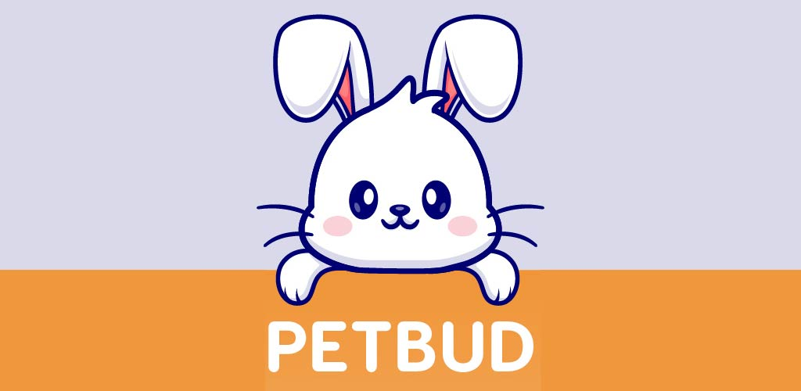

# PETBUD

  

PetBud is an Android application designed to support the mental well-being of children living with diabetes. It uses a gamified approach to make medication management more engaging and less stressful for children.

## Motivation
Diabetes management in children can be challenging and stressful. It's crucial to empower children to manage their condition, but the process can often feel daunting. PetBud aims to change this by gamifying the process. By caring for a virtual pet with diabetes, children can learn about their own condition in a fun and engaging way.

## Core Features
* **Virtual Pet**: Children care for a virtual pet that also has diabetes, mirroring their own condition.
* **Medication Management**: Parents input their child's medication details, and the child cares for the virtual pet by administering the same medication routine.
* **Parental Monitoring**: Parents can monitor the health of the virtual pet, which reflects their child's adherence to their medication routine.

## Complementary Features
* **Rewards System**: Children earn rewards for properly caring for their virtual pet, encouraging positive behavior.
* **Notifications**: Parents receive notifications about the virtual pet's health, keeping them informed.
* **Connection Through Care**: PetBud provides a platform for parents to connect with their child through the care of the virtual pet.

## Development & Technologies
PetBud was developed using Flutter, allowing for a cross-platform native experience with a single codebase. On the backend, we utilized Firebase to handle authentication, real-time database interactions, and cloud-based logic. Firestore was used for storing user data and syncing pet health states in real-time across parent and child devices. We also leveraged Firebase Cloud Functions to implement serverless backend logic, such as validating medication routines and sending real-time notifications. This architecture gave us full-stack development experience—from building the front-end UI in Flutter, to deploying scalable backend services with Firebase and integrating secure, cloud-native functionality.

## Project Background
This project was initially developed as part of an academic course at the Technion – Israel Institute of Technology. PetBud was presented at **Hackathon 2023**, where it ranked among the top teams. Following the event, the idea was recognized for its innovation and social impact, and the **Technion invited our team to continue developing the application under its supervision** as part of an extended initiative.
